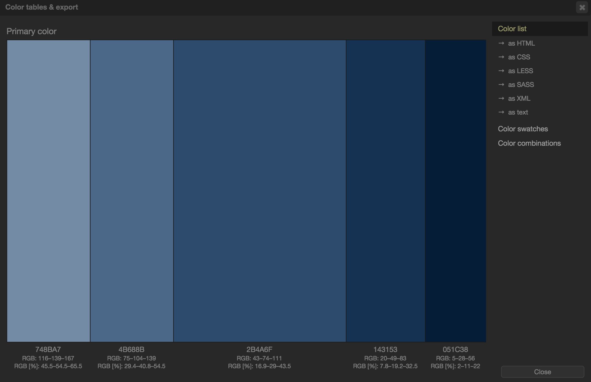
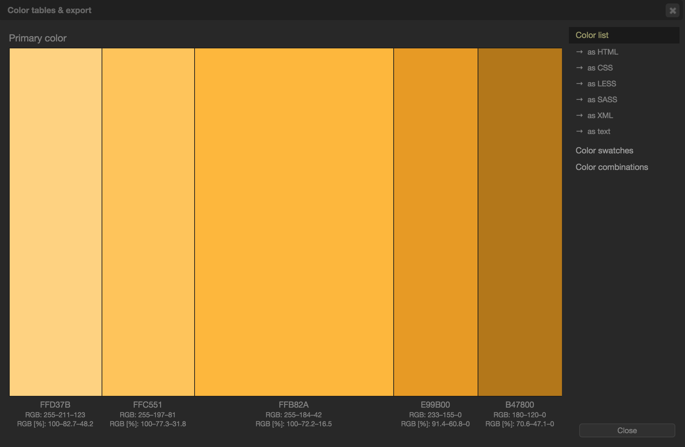
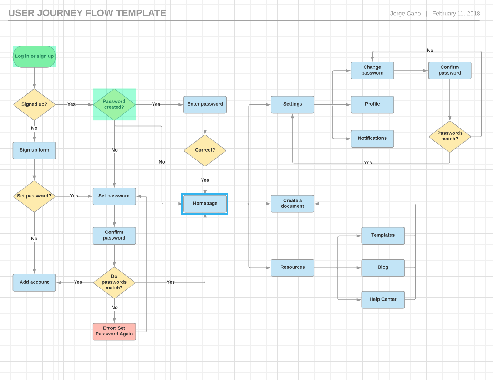

# User-Interface
client facing dashboard &amp; interface.

<!-- Have .SCSS file Watch CSS
Run this command in Bash: sass --watch css/style.scss:css/stylesheet.css -->

To Help Decide on Colors & Patterns in the Design:
http://paletton.com/#uid=13C0u0kllllaFw0g0qFqFg0w0aF

Decided to implement SASS for a CSS preprocessor:
https://sass-lang.com/



// SASS style sheet
// Palette color codes
// Palette URL: http://paletton.com/#uid=13C0u0kllllaFw0g0qFqFg0w0aF
*/ BLUES */

*/ As hex codes */

$color-primary-0: #2B4A6F; // Main Primary color */
$color-primary-1: #748BA7;
$color-primary-2: #4B688B;
$color-primary-3: #143153;
$color-primary-4: #051C38;


// As RGBa codes */

$rgba-primary-0: rgba( 43, 74,111,1);	// Main Primary color */
$rgba-primary-1: rgba(116,139,167,1);
$rgba-primary-2: rgba( 75,104,139,1);
$rgba-primary-3: rgba( 20, 49, 83,1);
$rgba-primary-4: rgba(  5, 28, 56,1);


http://paletton.com/#uid=10X0u0kqMy4gyJJlQChv+tcyAm-



*/ YELLOWS */

// As hex codes */

$color-primary-0: #FFB82A;	// Main Primary color */
$color-primary-1: #FFD37B;
$color-primary-2: #FFC551;
$color-primary-3: #E99B00;
$color-primary-4: #B47800;


// As RGBa codes */

$rgba-primary-0: rgba(255,184, 42,1);	// Main Primary color */
$rgba-primary-1: rgba(255,211,123,1);
$rgba-primary-2: rgba(255,197, 81,1);
$rgba-primary-3: rgba(233,155,  0,1);
$rgba-primary-4: rgba(180,120,  0,1);

SDLC - Steps for Success

```
GUI Requirement Gathering - The designers may like to have list of all functional and non-functional requirements of GUI. This can be taken from user and their existing software solution.

User Analysis - The designer studies who is going to use the software GUI. The target audience matters as the design details change according to the knowledge and competency level of the user. If user is technical savvy, advanced and complex GUI can be incorporated. For a novice user, more information is included on how-to of software.

Task Analysis - Designers have to analyze what task is to be done by the software solution. Here in GUI, it does not matter how it will be done. Tasks can be represented in hierarchical manner taking one major task and dividing it further into smaller sub-tasks. Tasks provide goals for GUI presentation. Flow of information among sub-tasks determines the flow of GUI contents in the software.

GUI Design & implementation - Designers after having information about requirements, tasks and user environment, design the GUI and implements into code and embed the GUI with working or dummy software in the background. It is then self-tested by the developers.

Testing - GUI testing can be done in various ways. Organization can have in-house inspection, direct involvement of users and release of beta version are few of them. Testing may include usability, compatibility, user acceptance etc.
```


